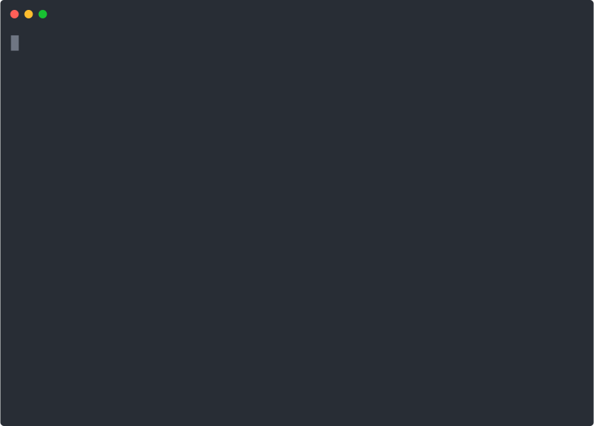

# kx - Time-box your Kubernetes sessions

 
 [](https://goreportcard.com/report/github.com/talss89/kx) 

 `kx` is a command line utility that lets you switch into a Kubernetes context for short period of time.

It's designed to help you reduce the risk of accidentally making changes to the wrong environment when working with lots of different clusters.

Just run `kx`, select your context, and use your shell as you would do normally. Once time is up, you'll be asked if you'd like to extend your session or wrap things up.

*`kx` tries to be polite, so if time runs out whilst you're deep in a terminal UI you'll only be interrupted once you return to your shell.*

*Don't worry, `kx` won't kill `helm` mid flow!*

## Get Started

You'll need `go 1.24`, and be running Mac OSX or Linux with a `zsh`, `bash` or `sh` shell.

```bash
go install github.com/talss89/kx@latest
```

Then just run:

```bash
kx
```

To control the duration of the session (default is 5 minutes):

```bash
kx 30s
```

To dive straight into a named context:

```bash
kx --ctx your-context
```
## Demo

<p align="center">
  
</p>

## State of the project

`kx` is a small personal project which I'll continue to develop gradually. Please feel free to raise any issues, or contribute via PR.
